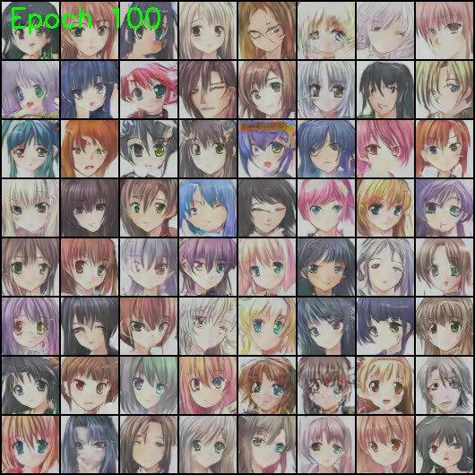

# AnimeGAN: Artistic Image Synthesis with Generative Adversarial Networks

  

---

## Overview

AnimeGAN is an exciting project that explores the world of Generative Adversarial Networks (GANs) for the generation of captivating anime-style images. This repository contains the code, dataset, and results of the training process, showcasing the evolution of image synthesis over multiple epochs.

**Project Highlights:**
- **GAN Architecture:** Discover the intricacies of the Generative Adversarial Network architecture tailored for anime image synthesis.
- **Training Process:** Follow the step-by-step process of training the GAN model on the Anime Face Dataset.
- **Results:** Witness the progression of image generation from noise to realistic anime faces over epochs.

---

## Results Showcase

### Video: Evolution of Anime Image Synthesis

Watch the full training video to observe the dynamic evolution of generated anime images over each epoch.

### Epoch Results
1. Epoch 1 - Initial Noise
   
  
2. Epoch 5 - Early Faces with Errors
   

3. Epoch 100 - High-Quality Anime Faces
   

---

## Getting Started

### Prerequisites

-       
- ...

