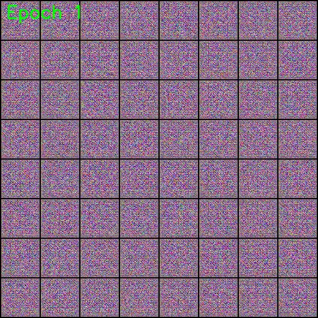

# AnimeGAN: Artistic Image Synthesis with Generative Adversarial Networks

<p align="center">
  
</p>

---

## Overview 🚀

In this project, I created a Generative Adversarial Networks (GANs) model for artistic image synthesis using PyTorch. The model consists of a generator and discriminator trained on the [Anime Face Dataset](https://github.com/bchao1/Anime-Face-Dataset) from either [GitHub](https://github.com/bchao1/Anime-Face-Dataset) or [Kaggle](https://www.kaggle.com/datasets/splcher/animefacedataset). The training involved 100 epochs, and the progress is visualized in a video showcasing generated images for each epoch.

## Table of Contents 📑

- [Project Title](#project-title)
- [Overview](#overview)
- [Table of Contents](#table-of-contents)
- [Demo](#demo)
- [Dependencies](#dependencies)
- [Usage](#usage)
- [Contributing](#contributing)

## Demo 🎥


> Showcasing generated images for each epoch (from 1 to 100).

Images:
1. Epoch 1 - Initial Noise
   
   

3. Epoch 5 - Early Faces with Errors
   
   

5. Epoch 100 - High-Quality Anime Faces
   
   

## Dependencies 🛠️


[](#)   [](#)   [](#)   [](#)   [](#)   [](#)


## Installation 💻

```bash
# Install dependencies
pip install python PyTorch opendatasets numpy matplotlib Pillow opencv-python
```

## Usage 🚀

To use and train the model:

1. Open the notebook in [Google Colab]([https://colab.research.google.com/your-notebook](https://colab.research.google.com/github/mouraffa/Generative-Adversarial-Networks-GANs-for-Anime-Image-Generation/blob/main/Generative_Adversarial_Networks_(GANs)_for_Anime_Image_Generation.ipynb)).
2. Change the runtime to GPU for faster training.
3. Modify the number of epochs in the notebook according to your preference.
4. Run the notebook.

For local machine usage, configure GPUs following the instructions in the first cell of the notebook.
